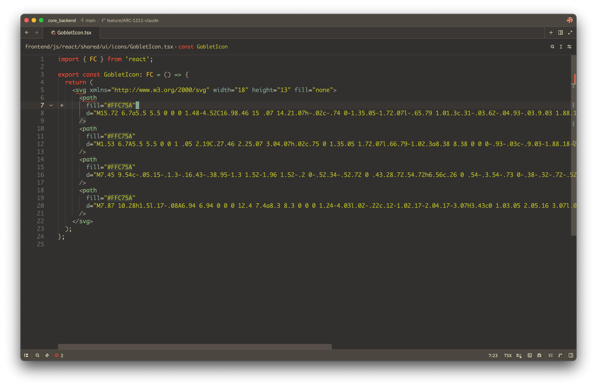
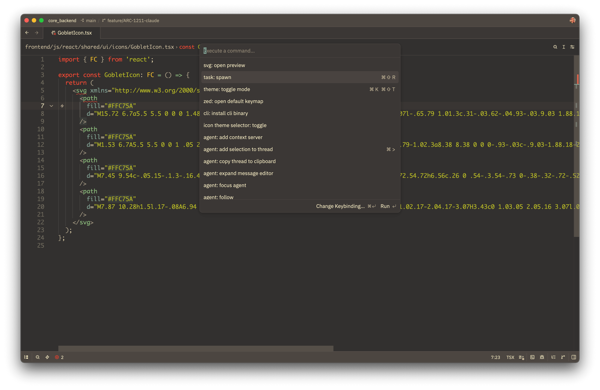
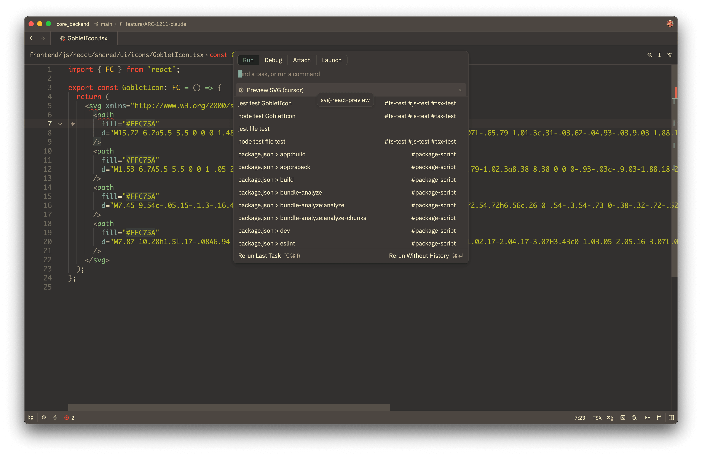
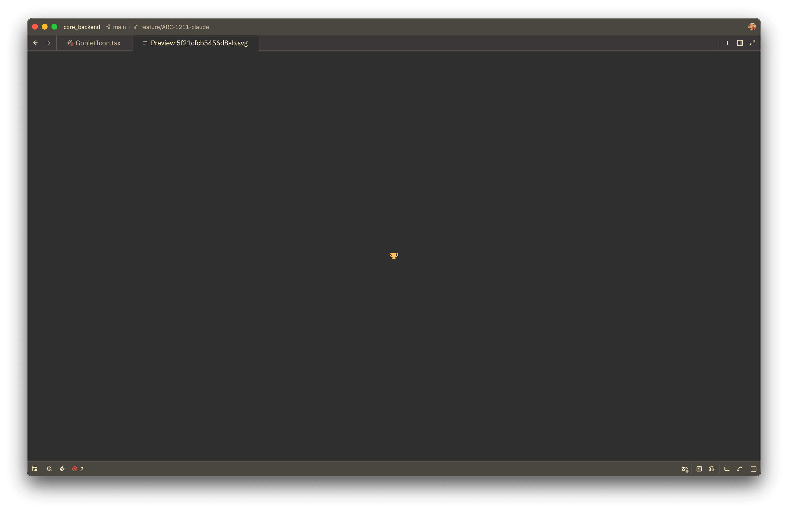
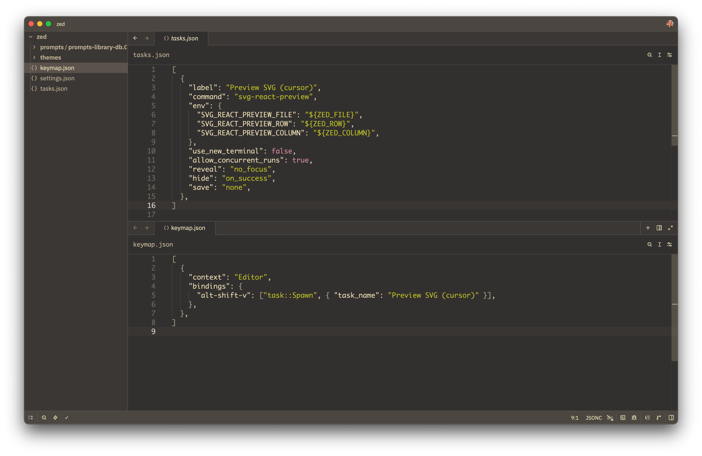

# svg-react-preview

CLI for previewing inline JSX/TSX SVG fragments in the **Zed** editor.

## The pain

You're staring at a React icon component. A wall of `<path>` data and viewBox math, and absolutely no idea what it actually looks like:



Zed has a beautiful native preview for standalone `.svg` files, but nothing for SVG fragments living inside JSX. Other editors have the same gap. Today the only options are: copy the markup into a scratch `.svg`, paste it into a browser DevTools, or pop open Figma. Every one of those breaks flow.

Zed doesn't yet expose an extension API surface that could solve this in-editor — so this tool wires it up through a **Zed task** and a tiny CLI. It's not the prettiest integration story, but it works today.

## What it does

Place the cursor anywhere inside an `<svg>…</svg>` element and run the task. The CLI parses the file with swc, finds the innermost enclosing `<svg>`, normalises it into a valid standalone `.svg` (JSX-isms like `className`, `strokeWidth`, dynamic `{props}` are translated or dropped — see [Behaviour](#behaviour)), writes it to `$TMPDIR/svg-react-preview/`, and opens that file in Zed so its built-in SVG preview can render it.

**1. Open the command palette and run `task: spawn`:**



**2. Pick "Preview SVG (cursor)" from the task list:**



The result — a real preview tab, next to your source:



### Platform behaviour

- **macOS** — fully automatic. AppleScript opens the file in Zed (so focus is guaranteed before the next keystroke), synthesises `Cmd+Shift+V` to spawn the preview tab, then sends `Cmd+Shift+[` + `Cmd+W` to close the redundant text-mode `.svg` tab — leaving exactly one preview tab per run.
- **Linux / Windows** — the `.svg` file opens as text in a new tab. One extra keystroke (`Ctrl+Shift+V`) switches it into preview mode. No synthetic-input permission prompts to deal with.

> The auto-close step relies on Zed default keymap (`Cmd+Shift+[` = `pane::ActivatePrevItem`, `Cmd+W` = `pane::CloseActiveItem`) and on the preview tab opening to the right of the source text tab in the same pane. If you remap those actions or your Zed opens preview in a split pane, the wrong tab may close — set `SVG_REACT_PREVIEW_HOTKEY=none` to disable all keystroke synthesis and trigger preview manually.

## Setup — step by step

### 1. Install the CLI

```bash
cargo install --git https://github.com/Segodnya/svg-react-preview
```

The binary lands at `~/.cargo/bin/svg-react-preview`. Make sure that directory is on your `PATH` (`echo $PATH | tr ':' '\n' | grep cargo` should print it; if not, add `export PATH="$HOME/.cargo/bin:$PATH"` to your shell profile).

### 2. Install the `zed` CLI shim

In Zed: **Zed → CLI → Install `zed` Shell Command**. This puts a `zed` binary on `PATH` so the tool can open files in your running Zed window.

Without the shim the tool still works — it writes the SVG to `$TMPDIR/svg-react-preview/` and prints the path to stderr — but you'd have to open it manually.

### 3. Register the Zed task

Open `~/.config/zed/tasks.json` (Zed: **command palette → `zed: open tasks`**) and add:

```jsonc
[
  {
    "label": "Preview SVG (cursor)",
    "command": "svg-react-preview",
    "env": {
      "SVG_REACT_PREVIEW_FILE":   "${ZED_FILE}",
      "SVG_REACT_PREVIEW_ROW":    "${ZED_ROW}",
      "SVG_REACT_PREVIEW_COLUMN": "${ZED_COLUMN}"
    },
    "use_new_terminal": false,
    "allow_concurrent_runs": true,
    "reveal": "no_focus",
    "hide": "on_success",
    "save": "none"
  }
]
```

### 4. (Optional) Bind a keyboard shortcut

In `~/.config/zed/keymap.json`:

```jsonc
[
  {
    "context": "Editor",
    "bindings": {
      "alt-shift-v": ["task::Spawn", { "task_name": "Preview SVG (cursor)" }]
    }
  }
]
```

Both files side-by-side:



### 5. macOS only — grant Accessibility permission

The auto-preview step synthesises a `Cmd+Shift+V` keystroke via `osascript`. macOS gates synthetic keystrokes behind Accessibility, so on first run grant access in **System Settings → Privacy & Security → Accessibility** to whichever process spawns the binary (typically **Zed.app**, since the task runs from Zed).

Without this permission the file still opens as text, and the tool prints a hint to stderr — just press `Cmd+Shift+V` yourself.

### 6. Try it

Open any `.tsx`/`.jsx` file with an inline `<svg>`, place your cursor inside it, and run the task (keybinding from step 4 or **command palette → `task: spawn` → `Preview SVG (cursor)`**). A preview tab should appear next to your source.

That's it.

---

## Reference

### Full task config (with optional hotkey override)

```jsonc
[
  {
    "label": "Preview SVG (cursor)",
    "command": "svg-react-preview",
    "env": {
      "SVG_REACT_PREVIEW_FILE":   "${ZED_FILE}",
      "SVG_REACT_PREVIEW_ROW":    "${ZED_ROW}",
      "SVG_REACT_PREVIEW_COLUMN": "${ZED_COLUMN}",
      // Optional: override the macOS preview shortcut (default cmd+shift+v).
      // "SVG_REACT_PREVIEW_HOTKEY": "ctrl+alt+p"
    },
    "use_new_terminal": false,
    "allow_concurrent_runs": true,
    "reveal": "no_focus",
    "hide": "on_success",
    "save": "none"
  }
]
```

If the cursor is not inside an `<svg>` element, the tool prints a clear error to stderr: `cursor at <file>:<row>:<col> is not inside an <svg> element`.

### Environment variables

| Variable                   | Purpose                                                          | Default       |
|----------------------------|------------------------------------------------------------------|---------------|
| `SVG_REACT_PREVIEW_FILE`   | JSX/TSX file path. Combined with `ROW`/`COLUMN` for cursor mode. | —             |
| `SVG_REACT_PREVIEW_ROW`    | 1-based cursor row.                                              | —             |
| `SVG_REACT_PREVIEW_COLUMN` | 1-based cursor column.                                           | —             |
| `SVG_REACT_PREVIEW_INPUT`  | Inline SVG/JSX fragment to render directly.                      | —             |
| `SVG_REACT_PREVIEW_HOTKEY` | macOS preview shortcut, or `none` to disable.                    | `cmd+shift+v` |

**Input precedence**: `FILE`+`ROW`+`COLUMN` → `INPUT` → stdin. Stdin example: `echo '<path d="M0 0"/>' | svg-react-preview` (handy for CI or quick smoke tests).

**Hotkey syntax**: `+`-separated tokens, case-insensitive. Modifiers: `cmd`/`command`, `shift`, `alt`/`opt`/`option`, `ctrl`/`control`. Keys: any letter, digit, `f1`–`f12`, `space`, `tab`, `return`/`enter`, `escape`/`esc`. If Zed has no binding for the configured shortcut, the keystroke is silently ignored — set `SVG_REACT_PREVIEW_HOTKEY=none` and trigger preview manually via the toolbar button.

### Behaviour

- `<Icon/>` (PascalCase, unresolved component) → placeholder `<rect/>` with a dashed border + warning on stderr.
- `{cond && <path/>}` → renders the right-hand side.
- `{a ? <path/> : <circle/>}` → renders the first branch.
- `{...props}` is dropped.
- Dynamic values (`{size}`, `{props.color}`) are replaced by defaults (24, currentColor, …) or the attribute is skipped.
- `className` → `class`, `strokeWidth` → `stroke-width`, `xlinkHref` → `xlink:href` (with `xmlns:xlink` auto-added).
- `onClick`, `onMouseEnter`, `htmlFor`, `dangerouslySetInnerHTML` → dropped.
- If the root is not `<svg>` or there are multiple roots, the output is wrapped in `<svg viewBox="0 0 24 24">`.

---

## Feedback

I built this for myself, but if it solves a real itch for you too — please try it and tell me how it goes:

- Does the workflow actually feel useful in your day-to-day, or is the "run a task" detour too clunky?
- Any JSX patterns the parser stumbles on? (Bring real-world examples — they make great test fixtures.)
- Linux / Windows users: is the manual `Ctrl+Shift+V` step acceptable, or worth automating?

Issues and PRs are very welcome over at [github.com/Segodnya/svg-react-preview](https://github.com/Segodnya/svg-react-preview). If you have ideas for a proper Zed extension once the API allows it, even better.

## Development

```bash
make test            # run unit + integration + CLI tests
make lint-pedantic   # clippy pedantic + nursery on host target
make lint-cross      # clippy on x86_64-unknown-linux-gnu (catches non-macOS warnings)
make verify          # full pre-commit gate (fmt + clippy host + clippy linux + test + deny + machete)
make install         # install svg-react-preview into ~/.cargo/bin
make help            # list all available targets
```

Previews are written to `$TMPDIR/svg-react-preview/<xxhash>.svg` (the file name is a stable hash of the source — re-opening the same fragment doesn't create new files).

### Toolchain

`rust-toolchain.toml` pins **Rust 1.95.0** + components `clippy`, `rustfmt`, `llvm-tools-preview`. `Cargo.toml` pins the same value as `package.rust-version` so `cargo msrv verify` passes. With `rustup` installed the right toolchain is selected automatically; on Homebrew Rust (no rustup) keep your local Rust at 1.95.x and the Makefile falls back to `/opt/homebrew/opt/llvm/bin/llvm-{cov,profdata}` for coverage (override via `LLVM_COV` / `LLVM_PROFDATA`).

#### Cross-platform lint (macOS dev → Linux CI)

CI runs `cargo clippy` on Linux, macOS, and Windows. macOS-only items behind `#[cfg(target_os = "macos")]` (`HotkeySpec::Custom`, `Opener::synthesise_keystroke`, the AppleScript module) are invisible to a host-only `make lint-pedantic` run on macOS — `make lint-cross` (and the pre-commit/pre-push hooks) catch them by re-checking against `x86_64-unknown-linux-gnu`. One-time setup:

```bash
rustup target add x86_64-unknown-linux-gnu
brew tap messense/macos-cross-toolchains
brew install x86_64-unknown-linux-gnu # provides x86_64-linux-gnu-gcc (~550 MB)
```

The cross check uses an isolated `CARGO_TARGET_DIR=target/cross-linux` to keep proc-macros compiled by Homebrew rustc out of the rustup-managed build's cache.

### Quality gates (CI)

The `.github/workflows/` set runs on every push to `main` and every PR targeting `main`:

- **`ci.yml`** — Linux, macOS, Windows
  - `cargo fmt --check`
  - `cargo clippy` (pedantic + nursery, `-D warnings`)
  - `cargo test`
  - `cargo build --release`
  - `cargo doc` (`-D warnings`)
- **`coverage.yml`**
  - `cargo llvm-cov` → Codecov
  - fails if line coverage < 95%
- **`security.yml`**
  - `cargo deny check all` (advisories + bans + licenses + sources)
  - `cargo audit` (RustSec)
- **`quality.yml`**
  - `cargo machete` (unused deps, stable)
  - `cargo udeps` (unused deps, nightly)
  - `similarity-rs` (duplicate code)
  - `cargo geiger --forbid-only` (unsafe stats)
  - `cargo outdated` (newer dependency versions)
  - `cargo msrv verify` (pinned MSRV still compiles)
  - `cargo mutants` (mutation testing)

All jobs are blocking. To reproduce locally install the tools once:

```bash
cargo install --locked cargo-deny cargo-machete cargo-llvm-cov cargo-mutants cargo-audit \
              cargo-geiger cargo-outdated cargo-msrv similarity-rs
rustup toolchain install nightly && cargo install --locked cargo-udeps
```

### Pre-commit / pre-push hooks (cargo-husky)

Hooks are committed under `.cargo-husky/hooks/` and installed automatically by `cargo test` (the `cargo-husky` build script copies them into `.git/hooks/`). After a fresh clone run `cargo test` once.

- **pre-commit** —
  1. `cargo fmt --check`
  2. clippy pedantic+nursery (host)
  3. clippy pedantic+nursery on `x86_64-unknown-linux-gnu` (skipped with a yellow warning if the cross C-toolchain is missing — see [Cross-platform lint](#cross-platform-lint-macos-dev--linux-ci))
  4. `cargo test`
  5. `cargo deny check`
  6. `cargo machete`
- **pre-push** —
  1. clippy on `x86_64-unknown-linux-gnu` (same skip behaviour)
  2. `make coverage-gate` (fails below 95% line coverage)

Both hooks fail with an explicit "install X" hint when a required tool is missing.

### Test coverage

```bash
make coverage        # per-file summary + uncovered line numbers
make coverage-html   # HTML report at target/llvm-cov/html/index.html
make coverage-gate   # fail if line coverage drops below 95% (override: COVERAGE_MIN=…)
```

## License

MIT
